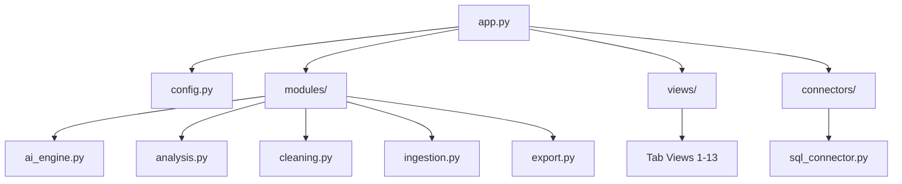

# AI Data Analyzer & Visualizer: Architecture Refactor

This document outlines the modular architecture of the application after the 2026 refactor from a 1800-line monolith to a decoupled, testable system.

## 🏗️ Structural Overview

## 📂 Directory Structure

| Path | Purpose |
| :--- | :--- |
| `app.py` | **Entrypoint Orchestrator**. Thin layer (~150 lines) managing tabs and session state. |
| `ui_theme.py` | **Design System**. CSS tokens, premium HTML components, and global styling overrides. |
| `modules/` | **Business Logic**. Pure Python functions for AI, ML, Data Ingestion, and Cleaning. |
| `views/` | **UI Components**. Individual modules for each Streamlit tab. |
| `connectors/` | **Data Abstraction**. Generic DuckDB/MotherDuck connection handling. |
| `tests/` | **Automated Testing**. Pytest suite for core logic validation. |
| `.streamlit/` | Streamlit specific configuration (secrets.toml, config.toml). |

## 🚀 Key Improvements

1.  **MotherDuck Fallback**: The app now gracefully falls back to local in-memory DuckDB if MotherDuck secrets are missing.
2.  **Lightweight Profiling**: Replaced `ydata-profiling` (~100MB+ deps) with `sweetviz` for faster, Streamlit-compatible data profiling.
3.  **Governance & Lineage**: Integrated "Git-Lite" version history in the sidebar to track all AI and manual transformations.
4.  **Agentic Data Surgery**: Tab 3 allows natural language "Surgery" on data with safe validation of AI-generated SQL.
5.  **Multi-Model Fallback**: AI Engine automatically tries Gemini, then Groq (Llama/Mixtral) to ensure 24/7 availability on free tiers.
6.  **Return-HTML Pattern**: Standardized UI components to return sanitized HTML strings instead of direct Streamlit calls, preventing layout collisions and allowing granular CSS control.

## 🛠️ Developer Setup

1.  Clone repo.
2.  `pip install -r requirements.txt`
3.  Set up `.streamlit/secrets.toml` with `gemini` and `motherduck` keys.
4.  `streamlit run app.py`
